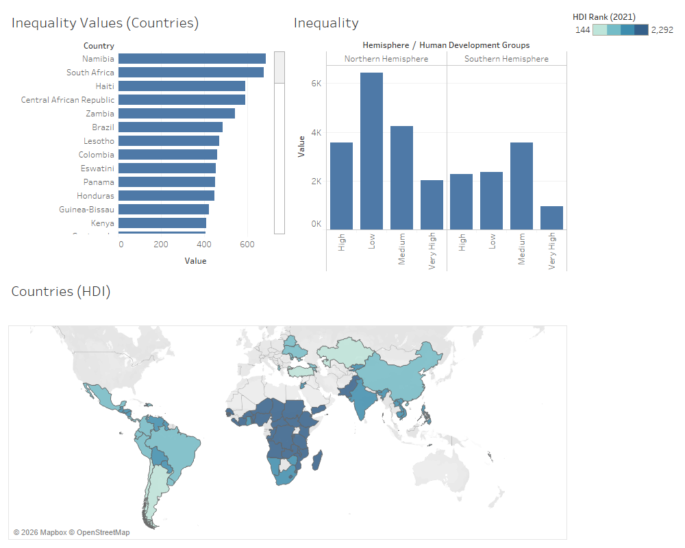

# 🌍 Income Inequality Across the Globe — Data Analysis Project



## Overview
This project explores **income inequality across 195 countries** from 2010 to 2021. The goal is to uncover global and regional patterns in income disparity using structured data analysis and visualization tools.

Data was sourced from [Kaggle](https://www.kaggle.com/datasets/iamsouravbanerjee/inequality-in-income-across-the-globe) dataset titled *"Inequality in Income Across the Globe"*.

> **Metric definition:** The *Inequality in Income* value used here is based on the **Atkinson index** — it measures the percentage loss in human development attributable to inequality in income distribution (UNDP methodology). Higher values = greater inequality.

---

## 📁 Project Structure

```
├── Inequality_in_Income.csv        # Raw dataset (original source)
├── income_inequality.xlsx          # Cleaned wide-format dataset
├── income_inequality_long.csv      # Transformed long-format dataset (unpivoted by year)
├── Income_Inequality.twb           # Tableau workbook for visualizations
└── index.ipynb                     # Jupyter Notebook — cleaning, transformation & EDA
```

---

## 📊 Dataset

| Attribute | Details |
|---|---|
| **Source** | UNDP Human Development Reports |
| **Countries (raw)** | 195 |
| **Countries with income data** | 171 |
| **Continents** | Africa, America, Asia, Europe, Oceania |
| **Time Period** | 2010 – 2021 |
| **HDI Groups** | Low, Medium, High, Very High |
| **Key Columns** | ISO3, Country, Continent, Hemisphere, Human Development Groups, UNDP Developing Regions, HDI Rank (2021), Inequality in Income (per year) |

> **Note on missing data:** 24 countries (e.g. Qatar, Saudi Arabia, Cuba, North Korea) had **no income inequality data** for any year and were excluded from analysis. Many other countries had partial data across years — these rows are retained where data exists.

---

## 🔧 Data Processing Workflow

### 1. Data Cleaning — Python (`index.ipynb`)

The raw `.csv` file was processed using **pandas** in a Jupyter Notebook:

- Loaded the raw CSV using `pd.read_csv()`
- Inspected missing values column by column
- Removed duplicate rows with `drop_duplicates()`
- Dropped rows where `Inequality_in_Income` was entirely absent
- Exported the cleaned data to `income_inequality.xlsx`

### 2. Data Transformation — Power Query (Excel) + Python

After cleaning, the year columns (2010–2021) were **unpivoted** so that each row represents one country × one year (**long format**). This was done in:
- **Excel Power Query** (produces `income_inequality.xlsx`)
- **Python / pandas** `melt()` inside the notebook (produces `income_inequality_long.csv`)

Both outputs are included so the project is fully reproducible without Excel.

### 3. Exploratory Data Analysis — Python (`index.ipynb`)

Full EDA was conducted on the long-format data including:
- Global average inequality trend (2010–2021)
- Breakdown by continent and HDI group
- Top 10 most and least unequal countries (2021)
- Countries with the largest improvement and worsening over time

### 4. Visualization — Tableau (`Income_Inequality.twb`)

The transformed Excel file was connected to **Tableau** to build interactive dashboards exploring inequality trends by country, continent, HDI group, and year.

---

## 🔍 Key Findings

| Finding | Detail |
|---|---|
| **Global inequality is declining** | Average fell from **24.32** (2010) to **22.81** (2021), a drop of ~1.5 percentage points |
| **Americas most unequal** | Highest regional average at **31.46**, followed by Africa at **28.98** |
| **Europe least unequal** | Lowest regional average at **15.22** |
| **HDI strongly predicts inequality** | Very High HDI countries average **17.95** vs **27.43** for Medium HDI countries |
| **Most unequal country (2021)** | 🇿🇦 South Africa — **56.99** |
| **Least unequal country (2021)** | 🇸🇮 Slovenia — **8.31** |
| **24 countries excluded** | Nations like Qatar, Saudi Arabia, and North Korea had no data reported |

---

## 🛠️ Tools & Technologies

| Tool | Purpose |
|---|---|
| Python (pandas, numpy) | Data cleaning, transformation & EDA |
| Jupyter Notebook | Interactive analysis environment |
| Microsoft Excel / Power Query | Data transformation (wide → long format) |
| Tableau | Data visualization & dashboards |

---

## 🚀 Getting Started

### Prerequisites

- Python 3.x with: `pip install pandas numpy openpyxl`
- Jupyter Notebook
- Microsoft Excel (with Power Query) — optional, long CSV is provided
- Tableau Desktop or Tableau Public

### Steps

1. Clone or download this repository.
2. Open `index.ipynb` in Jupyter Notebook to review and re-run the full analysis.
3. The notebook produces `income_inequality_long.csv` automatically.
4. Open `Income_Inequality.twb` in Tableau to explore the dashboards.

---

## 📜 License

This project is for educational and analytical purposes. Dataset credit goes to the [Sourav Banerjee](https://www.kaggle.com/iamsouravbanerjee).
